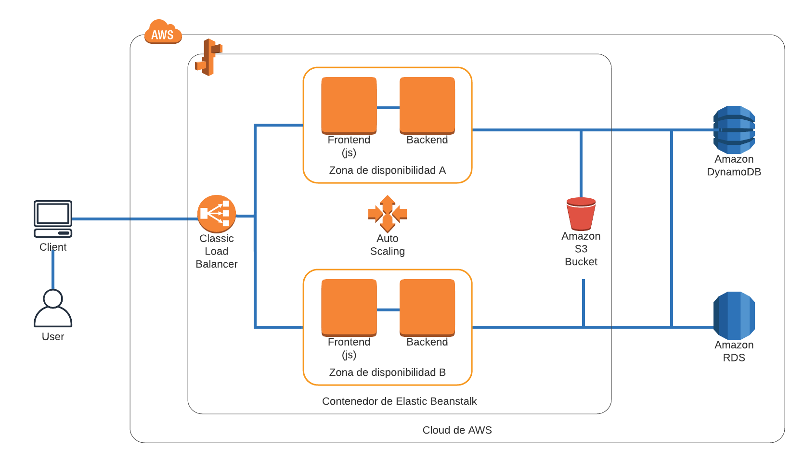

# Prueba 1: Diagrama de Red

_Esta prueba consiste en el desarrollo de un diagrama de red de una aplicación web que soporta cargas variables y alta disponibilidad._

## Resolución 📖

_Para resolverla utilicé la documentación de AWS para conocer los servicios, y ver ejemplos de uso. Elegí usar AWS ya que encontré el siguiente [proyecto](https://aws.amazon.com/es/getting-started/hands-on/deploy-nodejs-web-app/) que cumple con requerimientos pedidos. El cuál usé como modelo para desarrollar la prueba agregando los microservicios requeridos. Y además porque AWS asegura facilidad de uso, escalabilidad y desempeño y es seguro._

## Diagrama 📦

_Para realizar el diagrama de la red consideré que sean parte de él las siguientes APIs:_

* AWS Elastic Beanstalk: para implementar la aplicación.
* Amazon DynamoDB: para implementar la base de datos no relacional.
* Amazon RDS: para implementar la base de datos relacional.

## Elastic Beanstalk ⚙️

_Se usa el servicio de Elastic Beanstalk ya que permite manejar aplicaciones y además ofrece la administración automática de escalamiento y balanceo._

* Instancias EC2: en las instancias se implementa el frontend en js y en otra el backend.
* Amazon S3 Bucket: en el bucket se van a guardar todos los códigos de la aplicación web y los logs necesarios.
* Load Balancer: es el encargado de balancear las cargas entre las distintas zonas.
* Auto Scaling: es el encargado de asegurar la alta disponibilidad de la aplicación agregando automaticamente más instancias EC2 para acomodar la carga de la aplicación.

## DynamoDB 🔩

_DynamoDB es el encargado de administrar una base de datos NOSQL y asegura la alta disponibilidad y la escabilidad de tablas en base al trafico._

## Amazon Relational Database Service (RDS) 🔩

_Amazon RDS es el encargado de administrar una base de datos relacional asegurando los requerimientos._

## Links 

* [Implementar una aplicación web de Node.js](https://aws.amazon.com/es/getting-started/hands-on/deploy-nodejs-web-app/)
* [Conceptos Webserver](https://docs.aws.amazon.com/elasticbeanstalk/latest/dg/concepts-webserver.html)
* [DynamoDB](https://docs.aws.amazon.com/amazondynamodb/latest/developerguide/Introduction.html)
* [Amazon RDS](https://docs.aws.amazon.com/AmazonRDS/latest/UserGuide/Welcome.html)
