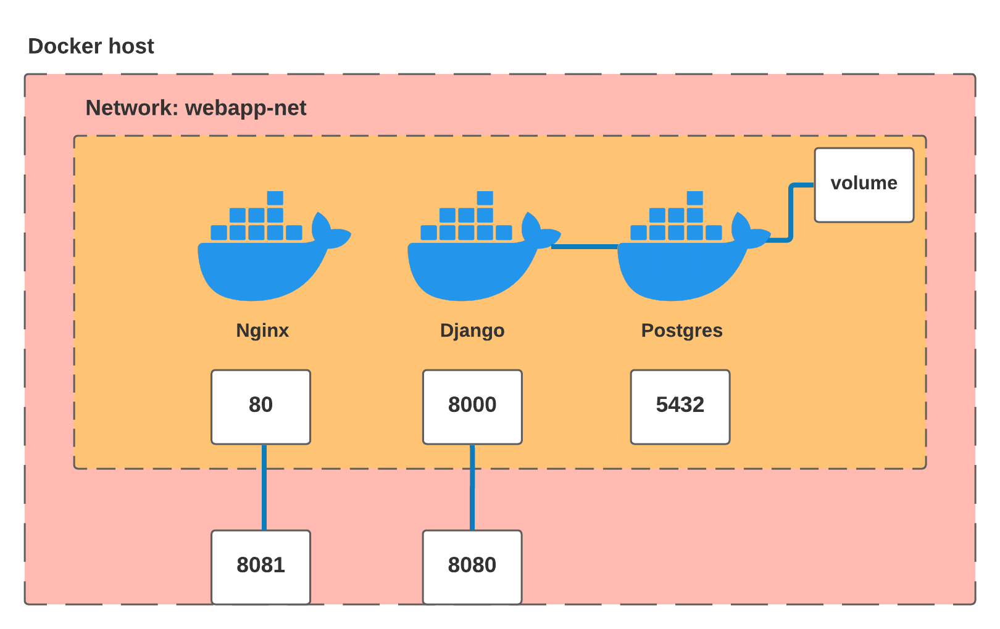

# Prueba 2: Despliegue de aplicación Django y React.js

_Esta prueba consiste en el despliegue dockerizado de una aplicación en Django (backend) con frontend en React.js._

## Resolución 📖

_Para resolver ésta prueba primero realicé los Dockerfiles de cada parte y una vez que me funcionaron armé el docker-compose para correr ambos contenedores más la base de datos postgres._

## Diagrama 📦



_En el diagrama se puede observar:_

* Nginx: frontend con los archivos de react.
* Django: backend a partir de la imágen de python que tiene instalada django.
* Postgres: base de datos con la imágen de postgres.

## Frontend - Nginx ⚙️

_Para deployar el frontend se utilizó la técnica de [multi-stage builds](https://docs.docker.com/get-started/09_image_best/#multi-stage-builds) para que utilizando la imágen de node buildear los archivos necesarios de react.js y luego copiarlos en los directorios correspondientes de una imágen de nginx._

Los pasos que se siguieron en este dockerfile fueron:

* Usar como base una imágen de Node.
* Copiar las dependencias necesarias.
* Se instalaron las dependencias a partir del administrador de paquetes npm.
* Se buildearon los archivos a partir de npm.
* Finalmente se copiaron los archivos finales en la carpeta correspondiente de nginx usando la imágen de nginx como paso final del multi-stage.

## Backend - Python: Django 🔩

_Para deployar el backend se utilizó como base la imágen de python 3.7._

Los pasos que se siguieron en este dockerfile fueron:

* Usar como base una imágen de python.
* Instalar dependiencias y paquetes apt.
* Copiar los archivos a una carpeta conocida de la imágen.
* Correr el server de django.
* Además se configuró un archivo *.env* donde se configuraron algunas variables de entorno como la SECRET_KEY de django, usuario, contraseña y otros de la base de datos postgres.


## Ejecución Containers 🔩

_Para correr cualquier contenedor se deben seguir los siguientes pasos:_

Estando en la carpeta donde se encuentra el dockerfile ejecutar:

```
$docker build -t <nombre-imagen>:<tag> .
```
Luego para correrlo:

```
$docker run -d -it -p <puerto-pc>:<puerto-imagen> --name <name> <nombre-imagen>:<tag>
```

## Docker-compose 📦

_Una vez en funcionamiento los dos containers se pasó a crear el docker-compose para correr la aplicación con todas las partes necesarias._

Los pasos que se siguieron fueron:

* Crear tres servicios: frontend, backend, db.
* Crear una network para contener los servicios.
* **Frontend:** se definió la carpeta donde esta el dockerfile para que haga el build, se agregó a la network y se configuraron los puertos.
* **Backend:** se definió la carpeta donde esta el dockerfile para que haga el build, se agregó a la network, se agregó la base de datos como dependencia, se agregó el archivo de variables de entorno y se configuraron los puertos.
* **BD:** se definió la imágen a usar (postgres), se declaró un volumen para que los datos se guarden en el equipo, se agregó a la network y se definieron algunas variables de entorno.

## Ejecución Compose 🔩

_Para correr la aplicación se debe ejecutar el siguiente comando estando en la ubicación del archivo docker-compose:_

```
$docker-compose up --build
```

## Desplegar la aplicación 🔩

_Para desplegar la aplicación se usó un nodo en Digital Ocean donde primero se creó una network y luego se subieron los archivos correspondientes._

Para crear los manifiestos a partir de docker compose estando en la carpeta del docker-compose:

```
$kompose convert -o <carpeta-destino>
```
Antes de subir los archivos al nodo se deben pullear las imágenes buildeadas al respositorio docker-hub.

Primero se tagean las imágenes:

```
$docker tag <nombre-imagen>:<tag> <usuario-docker-hub>/<nombre-imagen>:<tag>
```

Luego se realiza el pull al repositorio:

```
$docker pull <usuario-docker-hub>/<nombre-imagen>:<tag>
```

Para subir los archivos al nodo:

```
$kubectl -n <nombre-network> apply -f <carpeta-destino>/.
```

## Links 

* [Multi-Stage builds](https://docs.docker.com/get-started/09_image_best/#multi-stage-builds)
* [How to Dockerize a ReactJS App?](https://dzone.com/articles/how-to-dockerize-reactjs-app)
* [Quickstart: Compose and Django](https://docs.docker.com/samples/django/)
* [How to Use the Official NGINX Docker Image](https://www.docker.com/blog/how-to-use-the-official-nginx-docker-image/)
* [Amazon RDS](https://docs.aws.amazon.com/AmazonRDS/latest/UserGuide/Welcome.html)
